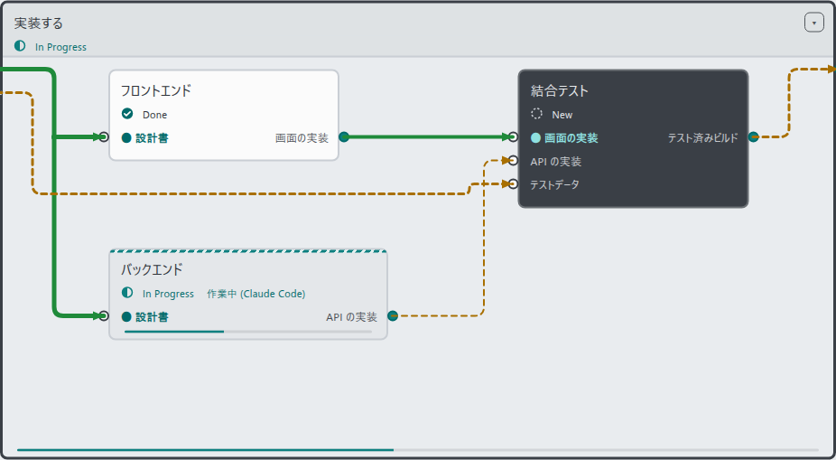
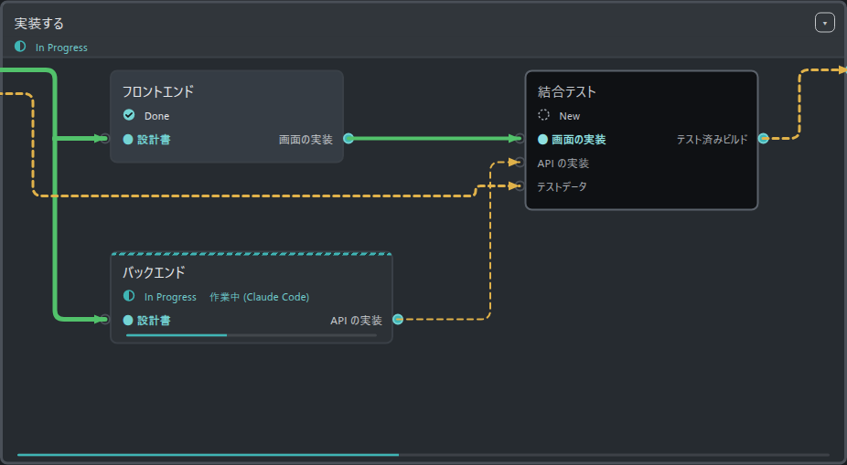

# UIデザイン更新 — 2026-10-05

採用済みの案を、既存の操作・保存方式・配置を維持して反映した。開始時点は `4753028e938f6d911589ee03cc3c1f87816b6c32`、作業前の実リポジトリはクリーン。本日の Home と VS Code の変更を含む状態から更新した。

## 追記: 配線の選択表示

利用者の追加指示により、選択中の配線は従来のオレンジ色の動く破線 (0.8秒周期) に戻した。矢印・分岐点・続きの経路・凡例もオレンジで統一。選択解除で確定／未確定の表示に戻り、詳細の状態と根拠は維持する。「動きを減らす」設定ではアニメーションを停止。他のデザイン変更は維持。下記は初回更新時の記録。

## 変更

- 確定配線は緑の実線、未確定配線は琥珀色の破線。選択時は外側に青灰色の輪郭を加え、芯・矢印・分岐点の状態色を保つ。キーボードフォーカス時の React Flow 既定色も同じ規則に合わせた。
- 配線の詳細に、既存の `isEdgeReady` 判定を用いた状態と判定の根拠を表示。
- ボックスのタイトルを優先し、状態アイコンを情報行へ移動。カテゴリ・ID・進捗率・通常の期日は選択時に表示。未回答の判断は活動記録の有無に関係なく小さなバッジで表示。
- 全面の斜線と継続的な発光を抑え、作業中は細いティールの帯と進捗バーで表示。
- ダークの完了面を落ち着いたグレーへ変更。完了時の一時的な光は維持し、動きを減らす設定にも対応。
- View モードの65%未満を俯瞰表示とし、入出力の文字などを簡略化。選択または Edit モードで情報を表示。ノード寸法・接続点・保存データは変えない。複数行のタイトルは文字を拡大せず、状態行へのはみ出しを防ぐ。
- 閲覧時の Auto Layout はメニューにまとめ、編集時は帯に表示。判断待ち件数を小さく強調。詳細の「担当／日程／その他／入出力」「回答する」を日本語化し、英語辞書も追加。

## 保持した機能

Home・保存・同期・データモデル・CLI・VS Code拡張の実装には変更なし。既存の New / In Progress / Done 表記、検索・追加・階層タブ・判断への回答・結線・整列・Undo/Redo は維持。公開、コミット、拡張の配布は行っていない。

## 検証

- `npm run build`: 成功。既存の500 kB超チャンク警告は残る。
- `npm test`: 22ファイル、381件成功。
- ブラウザ検査: 既存235項目と追加36項目、合計271項目成功。全体実行後、修正対象の design / canvas / experience を再検証した。
- 既存検査は保存の応答待ち・失敗・再試行・競合、VS Codeの空ファイル作成・外部更新・読み取り専用、英語、320〜1280px、クリックとドラッグの結線、Undo、整列、判断の記録を含む。
- 追加検査は両テーマでの確定／未確定線の選択・フォーカス・根拠・全経路の輪郭、俯瞰時の寸法保持・文字の復帰・データ不変・長い題名・活動記録なしの判断待ちを含む。
- 実計画の87ボックスの階層切替は中央値640ms。既存の交差・貫通検査も成功。
- ライトとダークの実画面を目視確認。Doneの入力文字コントラスト4.5:1以上を既存検査で確認。
- `git diff --check`: 成功。開始時のHEADが不変で、反映したファイルのハッシュも一致。他の変更を上書きしていない。

## 実画面

ライト:

ダーク:

検査ログと追加画像は、作業用のフォルダ (リポジトリの外) に保存した。
